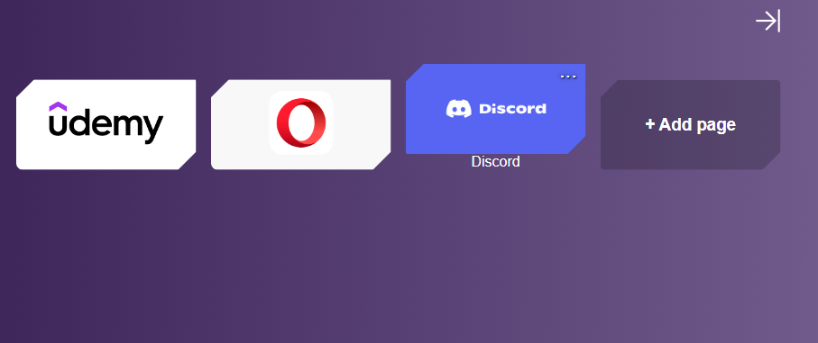

# Go Page

## Telas do projeto
<div float="left">
    
    
    
</div>

## Sobre
Projeto realizado com o objetivo de não utilizar nenhuma biblioteca externa no back-end com Node.js. Se trata de uma página onde você pode criar, deletar, editar e listar marcadores para te levarem até um site definido pelo atributo 'url' no momento de criação. Funcionalidade semelhante a de alguns navedores.

# Tecnologias utilizadas
## Back end
    - Nodejs

## Front end
    - HTML / CSS
    - React
    - Context API
    - TypeScript

# Executando o projeto
## Back end
```bash
# clonar o projeto
git clone https://github.com/diegocruz-s/api-no-framework

# entrar no diretório
cd server

# rodar o back end
npm run dev
```

## Front end
```bash
# entrar no diretório
cd web

# instalar as dependências
npm install

# rodar o projeto
npm run dev
```

# Autor
<p>Diego Cruz's</p>
<a href="https://www.linkedin.com/in/diegoscruz/">https://www.linkedin.com/in/diegoscruz/</a>